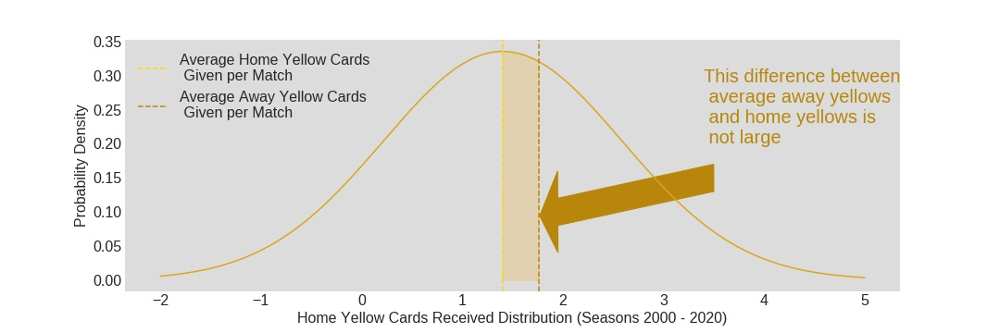
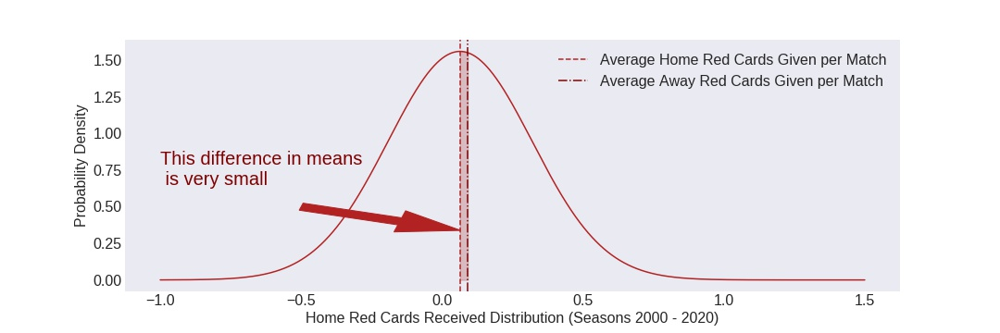

# Fan Influence in the English Premier League

  

## Table of Contents 

  1. [Overview](#overview)
  2. [Question and Hypothesis](#quest&hyp)
  3. [Exploratory Data Analysis](#EDA)
  4. [Visualization](#graphs)
  5. [Conclusion](#conclusion)
  6. [Credits](#Credits)

## Overview - Do You Influence Your Team's Chance of Winning?

In the world of professional soccer a players ability to read and react to the game is everything.  If you are the first to the ball, you control the situation, thereby giving your team the advantage in this moment.  As you sit in the stands watching your team battle it out against a hated rival, a loose ball rolls to an open spot on the field directly in between one of your players and one of their's.  As they sprint to the ball, your team gets there first and toes the ball past an out-of-contol opponent who crashes into your player.  A split-second before contact occurs, you and 60,000 of your commrades howl for blood.  The referee obliges and shows their player a red card, giving your team a massive advantage for the rest of the game.  

A few seconds later, you reflect on the tackle.  It really wasn't that bad.  It was a bit dodgy, but it may not have been enough to reduce them to 10-men.  Was it the crowd?  Did the roar of the fans pressure the ref to make a game-altering decision?  I wanted to find out if the number of cards (yellow and red) shown to players away from home has historically been significantly more than we would expect.

In soccer players who commited fouls cede a free kick to the opposing team at the position where the foul occurred.  If the ref deems a certain foul to be sufficiently reckless, the ref will show the player a yellow card.  This is akin to a technical foul in basketball.  If that player commits a second bookable offense, they are shown a second yellow and ejected from the game without replacement (i.e. two yellow cards equals one red).  If a foul is dangerous to the opposing player, that play can be shown a straight red card and ejected from the game without replacement.  

## Question and Hypothesis
  - Are referees significantly more likely to show red and yellow cards to away players?

I wanted to give this a test to see if the disparity between offenses punished on the road was enough to make a statistical difference over time.  But to be fair, I am sure that league officials have pondered this effect before so I aimed to take a more laxed look and lower my definition of what is 'significant'.  Do do this, I am considered the following:
  - Null Hypothesis: The number of bookings received by away players may be greater, but it is not significantly so.
  - Alternate Hypothesis:  The number of bookings received by away players is great enough to possibly have an effect on the outcome of matches.
  - Significance Level: 0.25 
  
## Exploratory Data Analysis
I found a great resource on [Kaggle](https://www.kaggle.com/irkaal/english-premier-league-results) from a user named irkaal. This csv contains all the games from the beginning of the 2000-2001 season through to matches played this month. The major concern was that the referee's names were in several different forms. My solution to this was to create a referee dictionary with the last names of the referees as the keys and a string of first and last names as the values.  To do this, I separated the last names in the referee column and created a new column.  Next I created a list of referees based on those names in a text file.  Lastly, I combined the last names and list into a dictionary and created a new 'ref_name' column in my data frame that input the full standardized name of the ref from the dictionary.  

Other than that, the data was solid.  There were about 25 rows of Nan values at the end that I lopped off, and I had to change the 'Date' column from a string to a datetime format, but minor switches.  The code I used to clean my data can be found [here](https://github.com/joshaldous/Galvinize-Capstone1/blob/master/src/EDACap1.py).

## Visualization

As a general formula, home teams tend to attack and be on the front foot more, while away teams try to keep an organized, defensive shape and patiently wait for oppurtunities to score.  At least that is how it was for most of the 20th century.  That formula is shifting to more of one where certain teams play certain ways regardless of where the match is held, but for at least the early part of my data, that could be considered to be a factor.  However, even if this is the case, there is still plenty of time in a match for home team players to be booked.  There are fast-breaking counter-attacks, tired-legs and tired-minds which can lead to rash decisions, and no team controls the ball for 90% of 90 minutes. So, straight away I wanted to see if the number of cards given to home teams was about equal to the number of cards given to away teams as a starting point.  

  

So you are more likely to be booked on the road. This got me a bit more interested and so I started to dig into the data more.  What do the scatter plots look like when you plot the home cards against the away cards?  I added in a diagonal line to show where we would expect the numbers to be if the distribution was truly random.

  

  

When I first looked at the Red Card scatter plot, I was surprised to see that most of the referees were on the 'home' side of the diagonal line.  The number of away reds are a greater propotion of the total red cards than the away yellows.  How could this be?  After a second glance, I noticed that the y-axis is twice what the x-axis values are.  This makes more sense.  In a one-to-one scatter plot, the dots representing each referee would be higher, but the graph overall would be more stretched out.  

There is one more visualization that I think makes this point clearly. The mean number of games reffed by a Premier League referee is about 120.  That's a little more than 3 seasons of games.  To get this number of games, the Professional Game Match Officials Limited (PGMOL), the group that oversees EPL officials, must hold you in high esteem.  These refs have to be the best at being impartial and calling matches according to the current rules.  The following graphs show the number of home and away cards shown by these top officials.

  

  

With the data prepared, I was ready to run my test.

## Conclusion

In order to see if the difference card count was significant, I decided to run a z-test.  I could calculate the sample mean and standard deviation and had a sufficient number of samples, so I imported weightstats from statsmodels.stats for a 2-variable z-test. I ran the yellow cards first.  hnorm_yell.pdf(x) is the normal distribution for home yellow cards over the interval [-2,5], and anrom_yell.pdf(x) is the normal distribution for away yellows over that same interval. Degrees of freedom is one minus the number of matches in the sample, since each match is independent and random.  The p-value for this test was 0.997, which is much greater than my alpha of 0.25.  
    
    statmodel.ztest(hnorm_yell.pdf(x),anorm_yell.pdf(x),ddof=7569)
    (0.0033134485216764734, 0.9973562554191262)

Next, to the red cards. hnorm_red.pdf(x) is the normal distribution for home red cards over the interval [-1,1.5], with anorm_red.pdf(x) the normal distribution for away red cards over that same interval. The p-value for this test was 0.999, also much greater than my alpha of 0.25.

    statmodel.ztest(hnorm_red.pdf(x),anorm_red.pdf(x),ddof=7569)
    (4.0847710039192654e-11, 0.9999999999674083)

In both cases, I cannot reject the null hypothesis.  In fact, the referees should be commended for their impartiatility.  I have two more visualizations to reinforce the result of the z-test.

  

  

## Credits

 1. I do not own, nor pretend to own any data, images, or copyrights having to do with the Premier League.  
 2. Data for the analysis was obtained from https://www.kaggle.com/irkaal/english-premier-league-results
 3. All plot were created by me using the data obtained and matplotlib.

